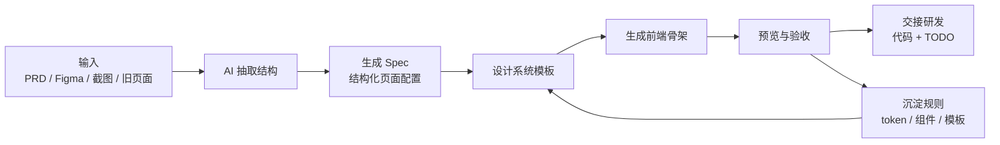

# AI 设计系统方法论草案

> 这份文档记录可迁移的方法论层：即使未来不再使用 Sens.Design，仍然可以复用这套「设计系统如何被 AI 使用」的工作方式。

## 1. 一句话定位

用 AI 把企业软件里的标准场景，从 PRD / 设计稿转成可运行、可验证、可交接的前端骨架；设计系统负责保证一致性，人负责判断边界和质量。

这不是让 AI 自由发挥生成页面，而是把设计师的规则、组件、token、验收标准和场景模板变成 AI 可以执行的流程。

## 2. 两层资产

### 2.1 设计系统专属层

这一层绑定具体公司和具体设计系统。以当前项目为例，它是 Sens.Design 专属的。

- token：颜色、间距、圆角、高度、投影、状态色。
- 组件：Button、Input、Select、Table、Badge 等具体实现。
- 视觉规则：功能色 / 状态色、组件状态、尺寸、图标、空态。
- 工程映射：antd / sensd 的 props、theme token、组件封装。
- 场景样板：数据源接入、筛选表格、配置表单、详情抽屉。

换一套设计系统时，这一层会被替换。

### 2.2 通用方法论层

这一层不绑定 Sens.Design，可以迁移到新的设计系统。

- token 作为设计与代码的共同真相源。
- 组件规则用 AI 可读文档表达，而不是只存在于设计师经验里。
- 每个组件同时维护设计向文档和研发向文档。
- 用预览页、状态矩阵、真实场景三种方式验收。
- 标准业务场景先抽象成 Spec，再由模板生成页面。
- AI 负责信息抽取和重复性生成，人负责判断、校准和验收。

未来的个人作品重点应放在这一层。

## 3. 标准工作流

核心原则：先生成结构化 Spec，再生成页面。不要让 AI 每次从零猜页面。

## 4. 角色分工

### 产品

- 提供 PRD、业务目标、字段、状态、异常、边界规则。
- 确认 AI 抽取出的业务结构是否正确。
- 不需要关心组件细节和 token 细节。

### 设计

- 维护场景模板和体验规则。
- 维护设计系统文档、token 映射、组件状态标准。
- 审查 AI 生成页面是否符合体验预期。
- 判断哪些差异是设计系统缺口，哪些是业务特殊性。

### 研发

- 接真实接口、权限、鉴权、数据流、复杂交互和上线工程规范。
- 使用生成的前端骨架作为起点，而不是从空白开始。
- 反馈组件库缺口和工程接入问题。

### AI

- 从 PRD / 旧设计中抽取结构化信息。
- 生成 Spec。
- 基于模板生成重复性页面骨架。
- 标注 TODO、风险和需要人工确认的点。
- 辅助跑构建、截图、检查样式回归。

## 5. 当前验证场景：数据源接入

数据源接入适合作为第一阶段 demo，因为它具备这些特征：

- 场景标准化程度高。
- 已有多个老数据源 PRD 可参考。
- 页面结构相对稳定：数据源管理、空态、连接列表、创建连接。
- 业务差异可以被抽成配置：名称、分类、需要的信息、表格列、表单字段、状态和操作。
- 不需要第一版接后端，适合先验证前端生成流程。

当前 demo 的目标不是生成最终生产功能，而是生成一个可讨论、可流转、可交接的第一版前端骨架。

## 6. DataSourceSpec 思路

`DataSourceSpec` 是 PRD 和页面模板之间的中间协议。

它应该描述：

- 数据源名称、分类、图标。
- 面包屑和页面标题。
- 信息区：帮助文档、需要的信息、说明文案。
- 连接列表：搜索占位、列、状态、操作、mock 数据。
- 创建连接：抽屉标题、基础表单字段、简化账号映射。

第一版刻意不描述：

- 后端接口。
- OAuth 真实授权。
- 权限系统。
- 真实数据同步。
- 复杂字段映射。
- 国际化完整方案。

这样可以把演示焦点保持在「PRD 能否转成标准前端骨架」。

## 7. 从流程到 Skill，再到 Agent

### 阶段一：流程和模板

先把数据源接入 Mini Flow 跑通：

- TikTok Ads 基准样例。
- Google Ads 或 Facebook 作为 PRD 抽取样例。
- DataSourceSpec。
- 标准模板。
- 可运行 demo。

### 阶段二：Skill

当流程稳定后，沉淀为 `datasource-connection-generator` skill。

这个 skill 应该规定：

- 先读 PRD，不要直接写页面。
- 先输出 DataSourceSpec，让人确认。
- 不碰后端。
- 页面至少包含数据源管理入口、空态、连接列表、创建抽屉。
- 样式必须走设计系统 token 和组件。
- 生成后必须跑构建。
- 输出研发接手 TODO。

### 阶段三：Yuwen Agent

多个稳定 skill 组合后，才形成长期目标里的 Yuwen Agent。

Yuwen Agent 应该能：

- 判断 PRD 属于哪类标准场景。
- 选择合适模板。
- 生成 Spec。
- 生成页面代码。
- 跑预览和截图。
- 输出验收清单。
- 记录设计系统缺口。
- 形成研发交接说明。

## 8. 8-9 月完整项目方案雏形

完整方案应包含：

- 项目背景：设计环节 AI 化，不是单纯设计师提效。
- 标准场景选择：数据源接入、筛选表格、基础表单、通用业务流程。
- 方法：PRD -> Spec -> 模板 -> 前端骨架。
- 设计系统依赖：token、组件、规则库、状态矩阵。
- 团队分工：产品 / 设计 / 研发 / AI。
- Demo：一个可基本流转的数据源接入流程。
- 风险边界：不碰后端，不替代业务判断，不保证一次生成最终稿。
- 路线图：Demo -> 模板化 -> Skill -> Agent。

## 9. 当前项目下一步

优先完成 TikTok Ads 的四段流转：

1. 数据源管理首页。
2. TikTok Ads 空列表页。
3. TikTok Ads 连接列表页。
4. 创建连接抽屉。

然后再做 Google Ads / Facebook 的 PRD -> DataSourceSpec 演示。
